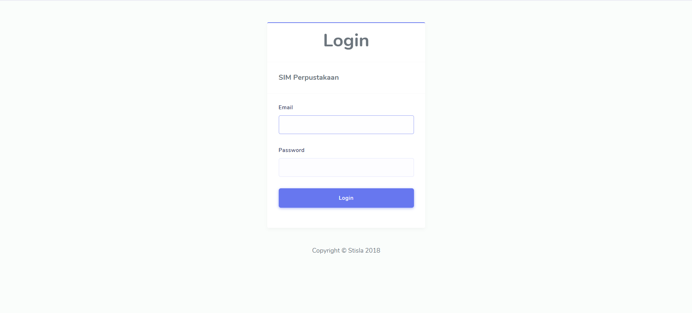
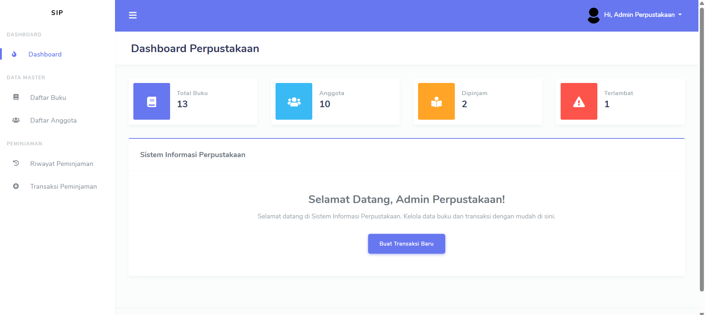
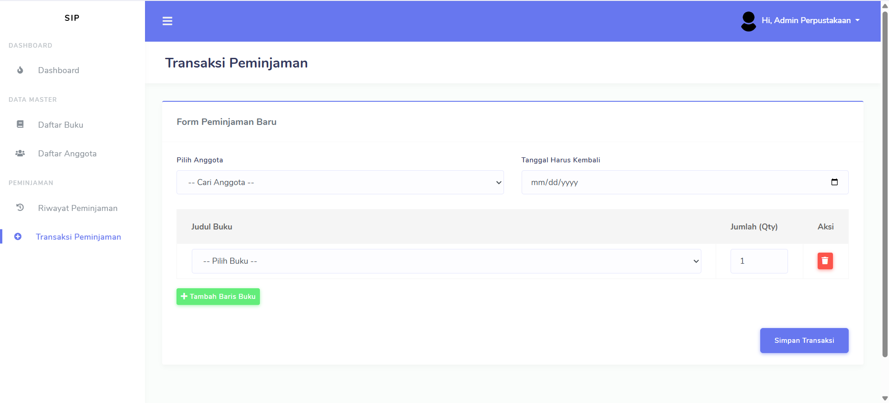
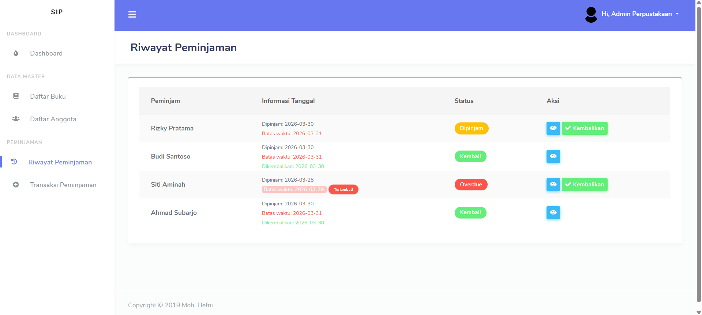

Sistem Informasi Perpustakaan berbasis Web yang dirancang untuk mengelola data buku, anggota, dan transaksi peminjaman secara efisien. Dibangun menggunakan **Laravel 11** dan template **Stisla Admin**.

## ✨ Fitur Utama

- **Authentication**: Keamanan akses masuk sistem untuk petugas.
- **Dashboard Statistik**: Ringkasan data buku, anggota, dan deteksi keterlambatan secara real-time.
- **Transaksi Peminjaman**: Input peminjaman buku dengan antarmuka yang user-friendly.
- **Riwayat & Pengembalian**: Pelacakan status buku dan proses pengembalian dengan kalkulasi tanggal otomatis.

## 📸 Dokumentasi Sistem

Berikut adalah tampilan antarmuka dari sistem yang telah dikembangkan:

### 1. Halaman Login

*Sistem pengamanan akses menggunakan otentikasi bawaan Laravel.*

### 2. Dashboard Utama

*Menampilkan statistik total buku, jumlah anggota, dan peringatan buku yang terlambat kembali.*

### 3. Transaksi Peminjaman

*Formulir input untuk melakukan peminjaman buku baru oleh anggota.*

### 4. Riwayat Peminjaman

*Daftar seluruh transaksi beserta status (Dipinjam/Kembali) dan indikator overdue.*

## 🛠️ Tech Stack

* **Framework:** Laravel 11
* **Template:** Stisla Admin (Bootstrap 4)
* **Database:** MySQL
* **Icons:** FontAwesome 5
* **Notifications:** iziToast